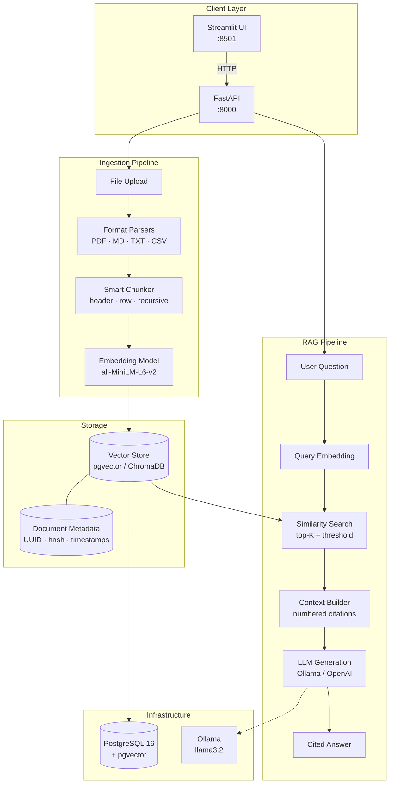

# AI Research Agent

A production-grade Retrieval-Augmented Generation (RAG) system that ingests heterogeneous research documents, indexes them in a vector database, and answers questions with inline citations.

Built as a portfolio project demonstrating end-to-end AI engineering: document parsing, intelligent chunking, local embeddings, vector search, LangGraph orchestration, and a dual FastAPI + Streamlit interface.

---

## Problem Statement

Research teams accumulate knowledge across PDFs, markdown wikis, meeting notes, and CSV exports. Finding specific information requires manually searching disparate sources — slow, error-prone, and unscalable.

This agent solves that by:

1. **Ingesting** PDF, TXT, Markdown, and CSV files into a unified index
2. **Retrieving** the most relevant passages via semantic vector search
3. **Generating** grounded answers with numbered inline citations
4. **Running locally** with free embedding models and optional Ollama LLMs — no API keys required

---

## Features

| Capability | Details |
|---|---|
| **Multi-format ingestion** | PDF (pypdf), Markdown (front-matter aware), TXT, CSV (row-to-narrative) |
| **Smart chunking** | Header-aware Markdown splits, CSV row batching, recursive overlap chunking |
| **Local embeddings** | `all-MiniLM-L6-v2` via sentence-transformers (384-dim, free) |
| **Vector stores** | PostgreSQL + pgvector (default) or ChromaDB (zero-config local) |
| **RAG pipeline** | LangGraph two-node graph: retrieve → generate |
| **Cited answers** | Numbered sources `[1]`, `[2]` with excerpt + relevance score |
| **LLM providers** | Ollama (local, default) · OpenAI (optional via `.env`) |
| **API** | FastAPI with `/health`, `/upload`, `/ask`, `/documents` |
| **UI** | Streamlit frontend for upload + Q&A |
| **Observability** | Structured logging (structlog), health checks, error hierarchy |
| **Deployment** | Docker Compose with PostgreSQL, Ollama, API, and UI services |

---

## Architecture



### Request Flow

```
Upload:  file → parse → chunk → embed → upsert → response
Ask:     question → embed → retrieve → context → LLM → cited answer
```

---

## Project Structure

```
ai-research-agent/
├── app/
│   ├── api/              # FastAPI routes and schemas
│   ├── chunking/         # Format-aware text splitting
│   ├── core/             # Config, logging, exceptions
│   ├── embeddings/       # sentence-transformers provider
│   ├── ingestion/        # Parsers and upload pipeline
│   ├── llm/              # Ollama and OpenAI providers
│   ├── rag/              # LangGraph pipeline + citations
│   ├── ui/               # Streamlit frontend
│   └── vectorstore/      # pgvector and ChromaDB backends
├── data/samples/         # Sample documents for demo
├── docker/               # PostgreSQL init scripts
├── scripts/              # PDF generator and seed utility
├── tests/                # Unit tests (pytest)
├── docker-compose.yml
├── Dockerfile
├── requirements.txt
└── .env.example
```

---

## Quick Start

### Prerequisites

- Docker & Docker Compose
- (Optional) Python 3.11+ for local development

### 1. Clone and configure

```bash
cd ai-research-agent
cp .env.example .env
```

### 2. Generate sample PDF (optional)

```bash
pip install fpdf2
python scripts/generate_sample_pdf.py
```

### 3. Launch the stack

```bash
docker compose up --build
```

| Service | URL |
|---|---|
| Streamlit UI | http://localhost:8501 |
| FastAPI docs | http://localhost:8000/docs |
| Health check | http://localhost:8000/health |

On first run, the `ollama-pull` service downloads `llama3.2` (~2 GB). The API may show `degraded` until the model is ready.

### 4. Seed sample documents (optional)

```bash
# With the stack running:
docker compose exec api python scripts/seed_samples.py
```

---

## Local Development (without Docker)

```bash
python -m venv .venv && source .venv/bin/activate
pip install -r requirements.txt

# Use ChromaDB to skip PostgreSQL
export VECTOR_STORE=chroma

# Start API
uvicorn app.api.main:app --reload --port 8000

# Start UI (separate terminal)
export API_BASE_URL=http://localhost:8000
streamlit run app/ui/streamlit_app.py
```

For full local setup with pgvector, start PostgreSQL with the pgvector extension and set `DATABASE_URL` in `.env`. For LLM answers, run [Ollama](https://ollama.ai) locally: `ollama pull llama3.2`.

---

## API Reference

### `GET /health`

Returns system status and component health.

```bash
curl http://localhost:8000/health
```

```json
{
  "status": "healthy",
  "version": "1.0.0",
  "vector_store": "pgvector",
  "llm_provider": "ollama",
  "components": {
    "vector_store": true,
    "llm": true
  }
}
```

### `POST /upload`

Upload and ingest a document.

```bash
curl -X POST http://localhost:8000/upload \
  -F "file=@data/samples/transformer_architecture.md"
```

```json
{
  "document_id": "a1b2c3d4-...",
  "filename": "transformer_architecture.md",
  "file_type": "md",
  "chunk_count": 12,
  "char_count": 2847,
  "message": "Document ingested successfully"
}
```

### `POST /ask`

Ask a question against indexed documents.

```bash
curl -X POST http://localhost:8000/ask \
  -H "Content-Type: application/json" \
  -d '{"question": "What BLEU score did the Transformer achieve?"}'
```

```json
{
  "answer": "The Transformer achieved a BLEU score of 28.4 on the WMT 2014 English-to-German translation task [1].",
  "citations": [
    {
      "index": 1,
      "filename": "transformer_architecture.md",
      "excerpt": "On the WMT 2014 English-to-German translation task, the base Transformer achieved 28.4 BLEU...",
      "score": 0.82,
      "chunk_index": 3
    }
  ],
  "retrieved_count": 5
}
```

### `GET /documents`

List all indexed documents.

```bash
curl http://localhost:8000/documents
```

---

## Demo Examples

After seeding sample documents, try these questions in the Streamlit **Ask** tab or via `/ask`:

| Question | Expected Source |
|---|---|
| "What BLEU score did the Transformer achieve?" | `transformer_architecture.md` |
| "What chunking strategies are used for CSV files?" | `rag_pipeline_notes.txt` |
| "What was the RAG answer relevance score for EXP-005?" | `experiment_results.csv` |
| "What are the key findings about RAG systems?" | `research_brief.pdf` |

---

## Configuration

All settings are managed via environment variables (see `.env.example`):

| Variable | Default | Description |
|---|---|---|
| `VECTOR_STORE` | `pgvector` | `pgvector` or `chroma` |
| `EMBEDDING_MODEL` | `all-MiniLM-L6-v2` | Local embedding model |
| `LLM_PROVIDER` | `ollama` | `ollama` or `openai` |
| `OLLAMA_MODEL` | `llama3.2` | Local LLM model name |
| `OPENAI_API_KEY` | _(empty)_ | Required only for OpenAI provider |
| `CHUNK_SIZE` | `800` | Max characters per chunk |
| `RETRIEVAL_TOP_K` | `5` | Chunks retrieved per query |

---

## Testing

```bash
# Run all tests (uses ChromaDB in /tmp, no external services)
pytest tests/ -v

# With coverage
pytest tests/ --cov=app --cov-report=term-missing
```

---

## Switching to OpenAI

```bash
# In .env
LLM_PROVIDER=openai
OPENAI_API_KEY=sk-...
OPENAI_MODEL=gpt-4o-mini
```

Embeddings remain local (free). Only answer generation uses the OpenAI API.

---

## Future Improvements

- **Hybrid retrieval** — combine BM25 sparse search with dense embeddings
- **Cross-encoder re-ranking** — re-score top-20 candidates before generation
- **Async ingestion queue** — Celery + Redis for large batch uploads
- **Evaluation harness** — automated RAGAS metrics (faithfulness, relevance, precision)
- **Multi-tenant isolation** — per-user document namespaces and access control
- **Conversation memory** — multi-turn Q&A with session context
- **Observability** — OpenTelemetry tracing, Prometheus metrics, LangSmith integration
- **Document deduplication** — content-hash based skip on re-upload

---

## License

MIT
